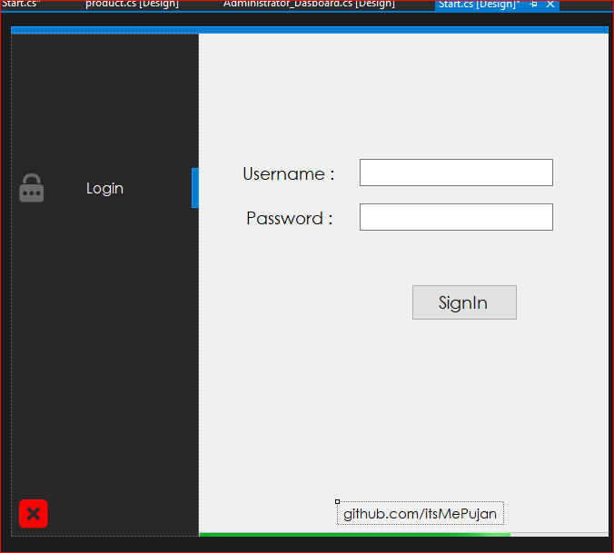
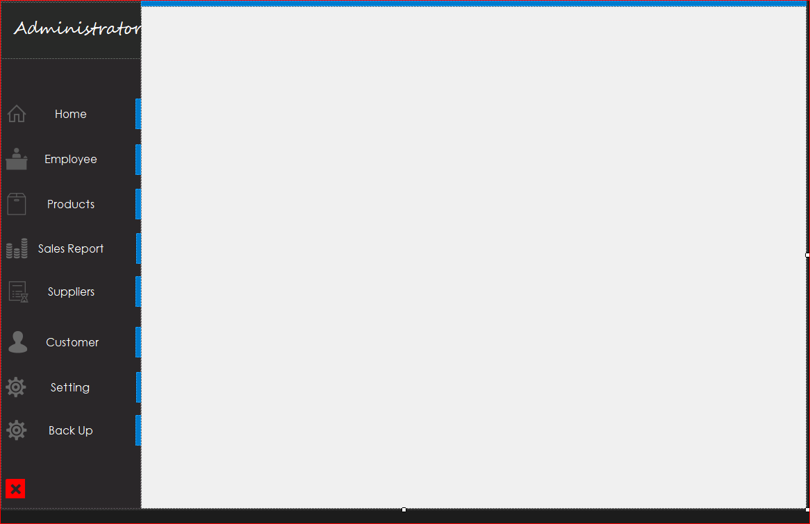
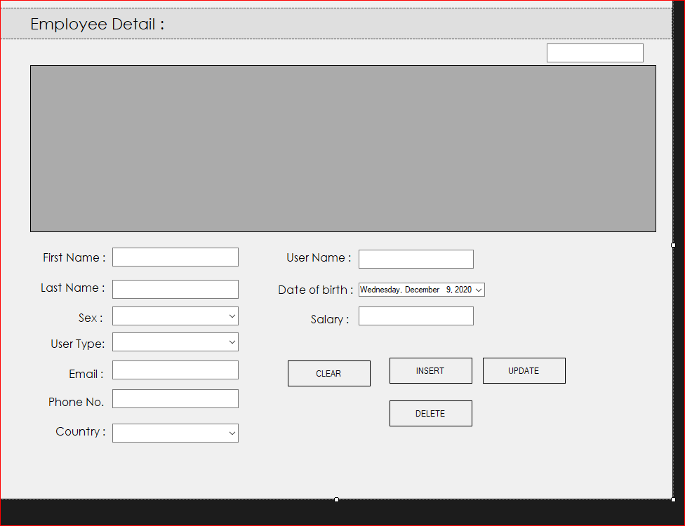
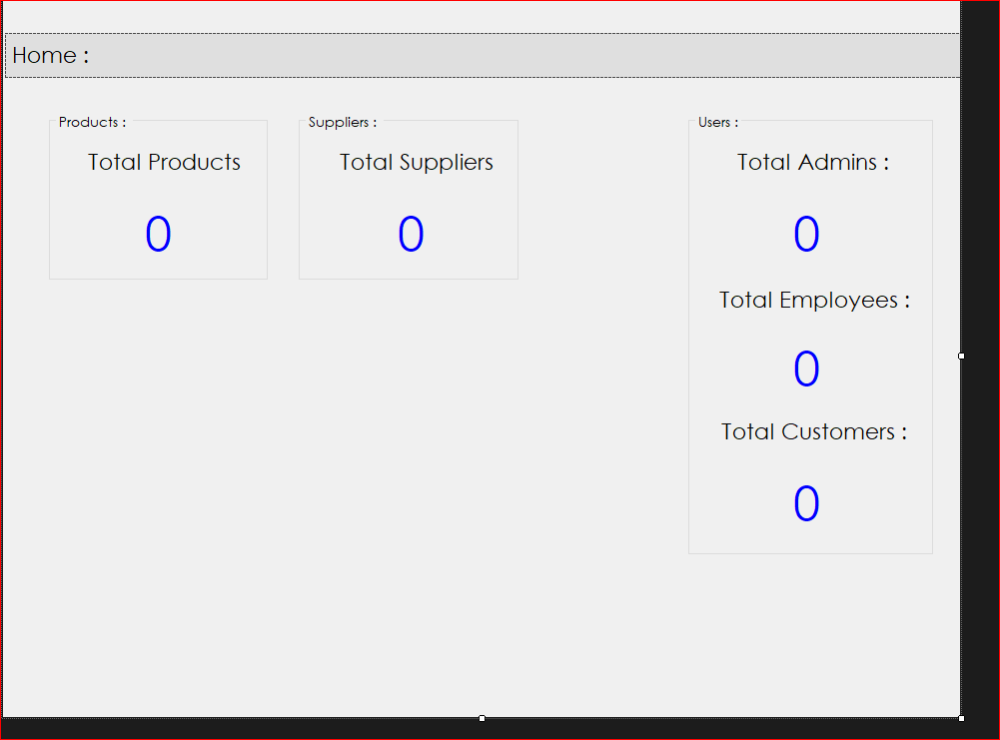
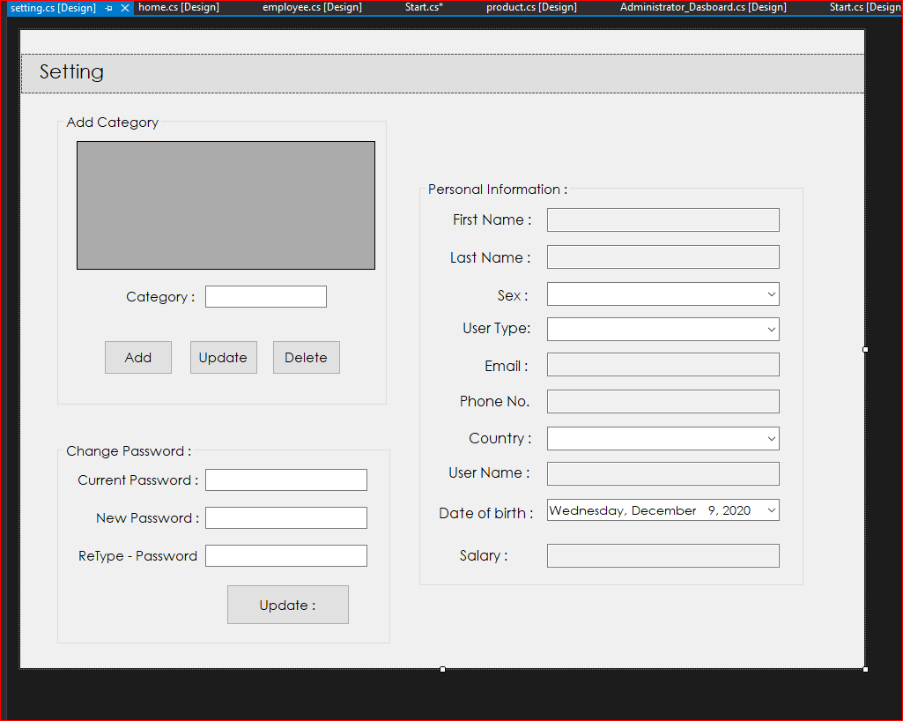
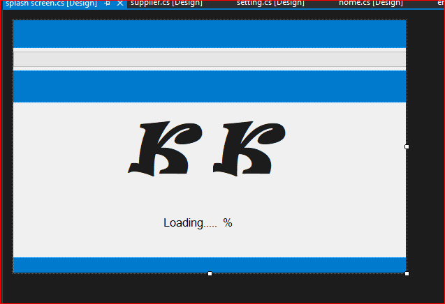
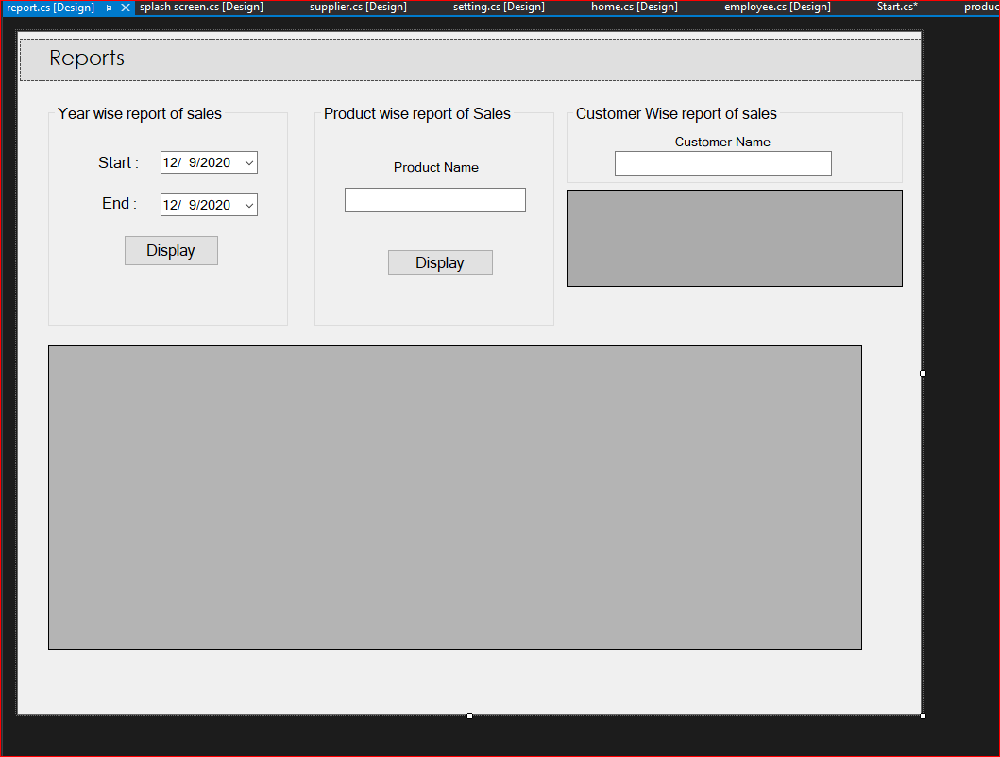
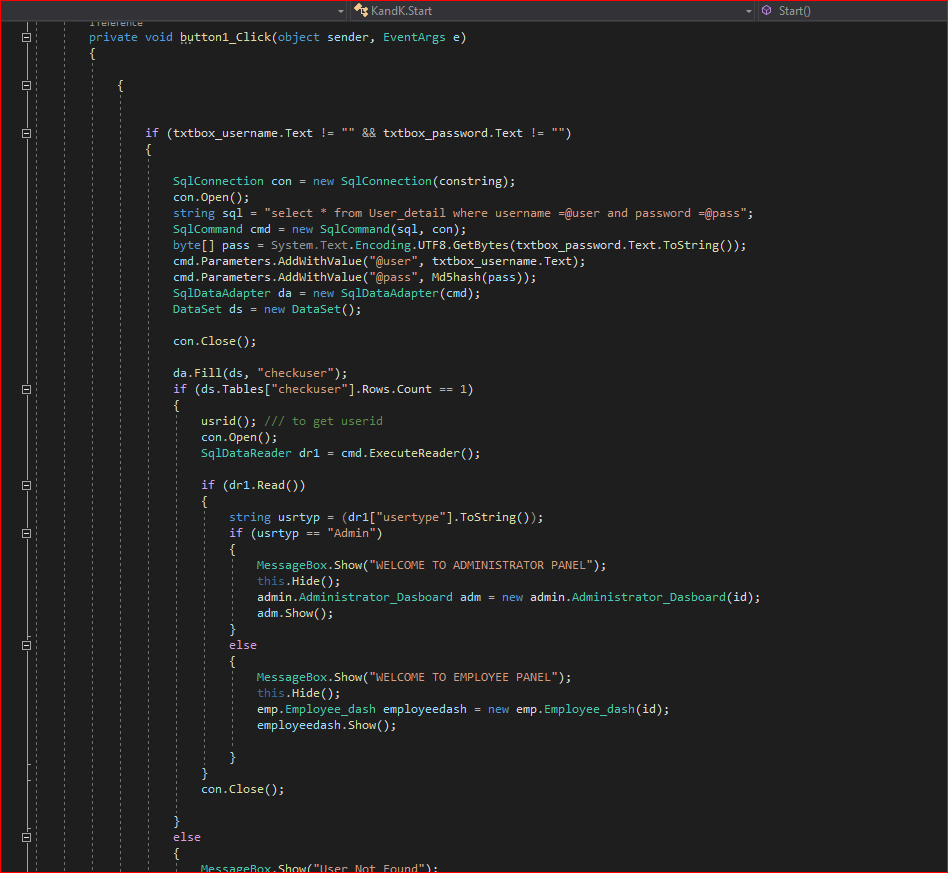
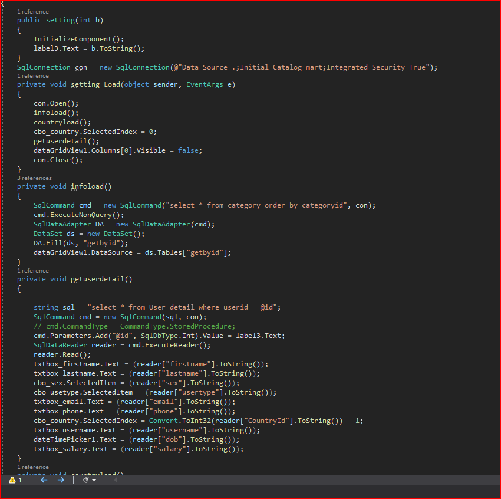

# KandK_Mart-College_Project
  It just a random project to pass out semester(1year bite sakeo tara ahela samma pass huna sakya xena). fuck lol!! 
  
K & K Mart is one of the leading departmental stores in the country. The department has various branches spread across the nation. The store offers variety of goods which include daily basic commodities such as fresh vegetables, meat, luxurious products such as perfumes, furniture to name a few. It attracts many customers each day. The management of the departmental store has a separate department to look into the goods that are to be sold to the customers. Furthermore, the management
intends to keep track of the employees recruited in the store.

The management of the store has information of all the products that are sold on a monthly basis on a hard copy. However, they are facing difficulty in keeping track of the goods sold. Also they need a mechanism to register new employees, view existing employees or in other words basically to keep track of the employees currently employed under their services. Hence, they have come up with a decision to automate the transaction and the employee list by means of developing an intranet desktop application called E-KKT (Electronic K & K Trade). You are assigned with the task of building such application. EKKT will keep track of all the products sold and also the employees working for the store. As there are technologies based on Object Oriented Programming principle available in the market, E-KKT should be
developed with the latest technology. You can choose programming languages such as C# .NET, and database like MySQL server.
The admin user of the application should be able to perform the following operations. The operations are
listed below:
  1 Insert Products
  2 Update Products
  3 Delete Products which are unavailable in the store
  4 Search specific product
Further he/she should be able to
 1 Register new employees
 2 Modify existing employee details
 3 Delete existing employees
 4 View employee details
  
  # Requiremnt to run Web Based Application
1. Visual Studio : To edit source code  
2. ssms(SQL Server Management Studio) : to config server, database. ( connection between applicion and database)

# Setup application
1. Clone Project (KandK_Mart-College_Project)
2. if your are looking for this project you should know how to configure others project.  dont be too lazy kid. Spend some time in study. 

# Here is the Screenshot 

